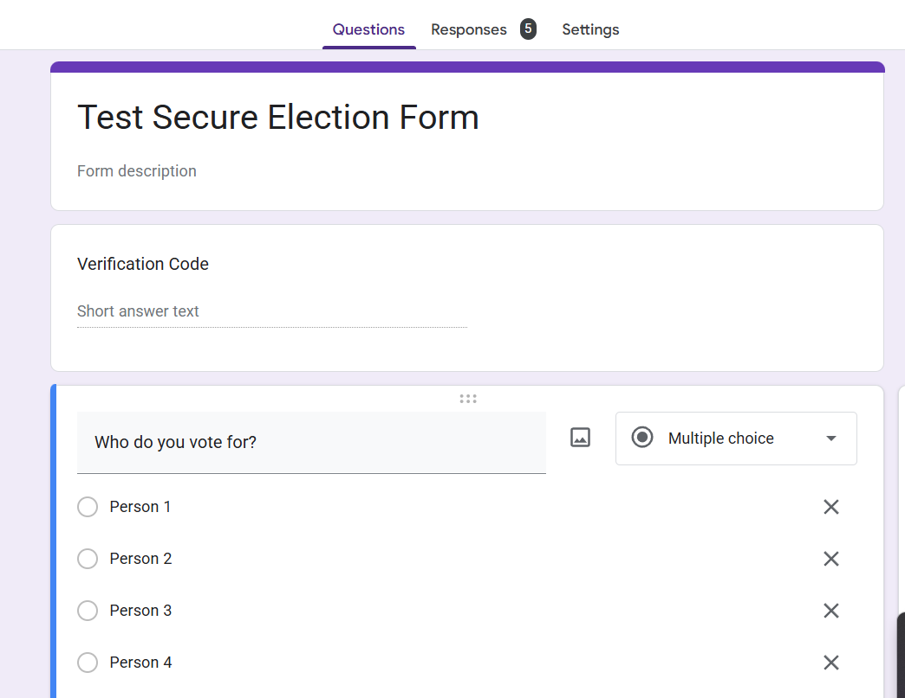

# Secure Election Form

This script will allow you to run more secure and anonymous elections for your organizations through Google Forms. By using randomized verification codes, this system will allow you to check to make sure each person only submitted one response while keeping the user's identity fully anonymous to prevent retribution for voting choices. While Google Forms might already have options to limit to one submission, this also prevents users from using multiple email addresses to submit multiple votes, verifying that every vote counts equally while keeping submission anonymous. Additionally, the script permanently deletes all sent emails with verification codes.

Unfortunately, the script itself is not enough and some setup is needed as well.

## Setting Up the Form

To start setting up the election form, you need to create a simple Google Form. Make sure the form, as well as any spreadsheets or scripts linked to it, do not use an email address you plan to vote with. If you, as the host of the election, would like to vote, you must use different email addresses to create the form and vote with. Failure to do so may result in your validation code email being deleted, resulting in you being unable to respond to the form. The email address of the user responding should never be collected and the first question in the form must be titled "Verification Code" and have a short answer response. After this, any questions for who/what to vote for in the election should be included just as in a standard election Google Form.

This "Verification Code" question will allow the user to input the verification code they receive in their inbox to ensure their vote is securely counted.

### Setting Up the Spreadsheet and Script

The next step of setting up the form is setting up its corresponding spreadsheet. To do this, you first need to connect the Google Form to a newly created Google Sheets spreadsheet. You can do this from the "Responses" tab.

From your spreadsheet, click "Apps Script" from the "Extensions" menu. Now, place all the code in `Code.gs` into the script editor you see. 

The code will not immediately work, however. Click the plus sign next to "Services" in the left-hand menu. While here, you must add the Gmail API. This is what allows permanently deleting sent emails.

Now, you must add a trigger for the script. Specifically, on opening the spreadsheet, the onOpen function should run. To test this trigger, you can reload the spreadsheet and you should see a new menu titled, "Secure Elections."

Under this menu, click "Create Form Spreadsheet" to set up the spreadsheet as is necessary to verify votes. However, a few manual changes do need to be made as well.

In the newly created "Emails" sheet, range A2:A (column A starting with A2) should have a list of email addresses to send verification codes to. This can be automated, but works best manually, considering it might be possible for someone to enter two of their own email addresses if there is an automated self-registration system. Column B should not be edited and will be automatically edited by the script.

Cell E1 should have a name given to the election. No double quotes should be used here. If double quotes are used, the system to delete emails may fail and the security of the election may be compromised.

Lastly, cell E2 should have the link to your form. You can find this link when you deploy the Google Form for submissions. 

### Vote Counting Systems

It is possible to implement any vote counting method with this system. As long as you can implement a method in Google Sheets, you can use it, and even if you can't do that, it is possible to manually count the votes as well. However, there are also automated methods of vote counting that can be implemented through the "Implement Vote Counting" sub-menu. Currently, only plurality voting (most votes wins) and first past the post voting (candidate with 50% of the votes wins; might not happen which would show an error). However, future updates are expected to add more voting methods, such as Ranked Choice Voting and the Condorcet Method. If using the automated vote counting logic implementation, you should click on a cell in the same column or columns as the questions you want to add this vote counting method for before clicking the button to implement your preferred method. It is possible to implement this for multiple election questions at once by selecting a range containing multiple columns before clicking the button to add the method.

## Running the Election

Running the election once everything is set up is very straightforward. You can also run the election with a bunch of your own emails to verify everything works. If you only own two email addresses (if you only own one, you will need to create another), you can use the one you did not use to create the form in several variations using a `+`. For example, if your email address is `myname@gmail.com`, you can use `myname+voter1@gmail.com`, `myname+voter2@gmail.com`, etc. to run your election. Please note that you cannot use this trick with the email address used to set up the form. Since all these email addresses share the same inbox and it is the inbox (and outbox) that matters for deletion, not the email address, the emails will still be deleted if you use this trick.

Anyways, here are the steps to run your election:

1. List the email addresses of all who plan to vote in the election in column A of the "Emails" sheet.
2. Ensure the form name and form link are valid and correct.
3. Click `Secure Elections > Send Emails` from the spreadsheet.
4. Wait for everyone to vote. Everyone should receive an email with a validation code and a link to submit the form.
5. Check the results! After everyone has voted, you can first check to make sure a re-run isn't needed, and then use your election logic you added in (or hand-counting votes if you want to go old-school) to figure out who won the election!

It is good practice to ensure everyone has voted and everyone's votes are counted. The number of filtered valid responses should be equal to the number of people voting. Hand-verification of votes can also be helpful in case your automated logic is incorrect. It is best to test several times with different inputs to ensure the logic is correct before using it.

## Features

This script has several useful features to help run your election smoothly! These features include...

- **Authentication with randomized codes** - Randomized codes are not linked to the person in any way and are fully random! This means your voters won't have to worry about someone seeing their email address or name!
- **Automated email links** - The link to your Google Form will automatically be sent through email, along with the validation code, to everyone you set up in the list to vote!
- **Automatic email deletion** - Although your account is used as the host to send the emails, this script will automatically delete them so that only the recipient is able to see what their validation code is and anonymity of the election is preserved!
- **Strict one-vote requirements** - Google Forms comes pre-packed with a system to make sure each email address can only vote once, but this allows you to make sure each person only votes once! People can use multiple email addresses to cheat most other systems, but this allows you to make sure each person only votes once while also not requiring email collection or restriction to an enterprise organization!
- **Compatibility with any vote-counting system** - Since this system is only used for authenticating votes and validating that each vote is only counted once (and nobody votes for someone else), you can add any system of vote-counting to the spreadsheet or even do it by hand! Some anonymous voting systems may come with a specific vote-counting system pre-included, but this system allows you to bring your own election logic while providing some of the most secure authentication methods possible for a Google Form made available to anyone with the link!
- **Automated Spreadsheet Setup** - The latest version of this system automates the setup of your spreadsheet so you don't have to put in as much work to implement the secure election system!
- **Automatic Implementation of Vote Counting** - The latest version of this system contains a few vote counting methods that can automatically be implemented with a click of a button, simplifying the process of running elections with common vote counting methods!

## Planned Features

- **More Vote Counting Methods** - Not all ballots are created equal, so future updates to this system will include additional vote counting methods, such as Ranked Choice Voting, Borda Count, Approval Voting, Score Voting, and the Condorcet Method.
- **More Robust Detection of Necessary Recounts** - One benefit of using this system over a standard in-person secret ballot by paper is that it technically allows the identification of what verification code was used to double-vote. Specifically, if someone voted twice with the same verification code for all the same candidates, the duplicate vote could simply be removed and counting could continue as normal. While this can be determined manually, future updates of this system will include this more robust detection of the necessity of recounts to improve the efficiency of elections if someone does try to vote twice.

## The License

This code is licensed under the BSD 2-Clause license. The idea behind this is that everyone should be able to use this script freely without having to share the source code! Since this script is intended to work alongside Google GSuite products such as Google Forms, Google Sheets, and Google Apps Script, this license allows this code to be freely available without any restrictions that may come with stricter copyleft licenses!

Thank you for using this script/system and please let me know through an issue (or in person if you know me) if you have any questions!
